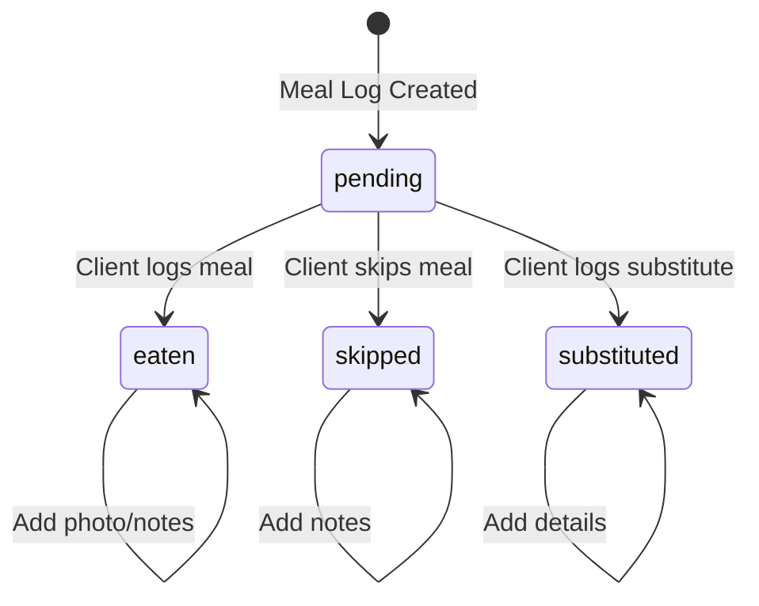

# MealLog Status State Machine

## Overview
The `MealLogStatus` enum defines the possible states of a meal log entry.

## States

| Status | Description |
|--------|-------------|
| `pending` | Initial state - meal scheduled but not yet logged |
| `eaten` | Client marked the meal as consumed |
| `skipped` | Client explicitly skipped this meal |
| `substituted` | Client ate something different from planned |

## State Transition Diagram

## Allowed Transitions (Client)

| From | To | Action |
|------|-----|--------|
| `pending` | `eaten` | Client logs that they ate the planned meal |
| `pending` | `skipped` | Client indicates they didn't eat this meal |
| `pending` | `substituted` | Client ate something different |

## Dietitian Review
- Dietitians can add `dietitianFeedback` to any log
- Review sets `dietitianFeedbackAt` and `reviewedByUserId`
- **Status cannot be changed after dietitian review**

## Not Allowed
- `eaten` → `skipped` (once logged, cannot undo)
- `skipped` → `eaten` (would need a new log entry)
- Any status → `pending` (cannot reset to initial state)

## Business Rules

1. **3 referrals = 1 free month**: Documented in referral logic
2. **Photo required for eaten**: Optional but encouraged
3. **Substitute details**: When `substituted`, should provide `substituteDescription`
